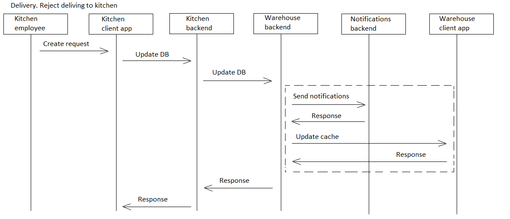

# preparemeal

[English](preparemeal.md) | [Русский](preparemeal.ru.md)

Name: **Prepare order**.

The prepare food scenario in the delivery service app involves retrieving the order details from the database, calculating the required ingredients and cooking instructions, and preparing the food according to those instructions. 
The app updates the status of the order as it is prepared and notifies the kitchen staff when it is ready for delivery.

Flowchart name: [delivering](../../flowchartnames/delivering.md)

Responsible modules: [client application](../../frontend/kitchenclient.md), [backend service](../../backend/kitchenbackend.md)

Platform version: v0.1

## Dependencies

### Depends on

| Backend service | Process |
| --- | ---- |
| [customerbackend](../../backend/customerbackend.md) | [preprocessorder](../delivering/preprocessorder.md) |

## Process description

This process is called from the [preprocessorder](../delivering/preprocessorder.md) process.

### Flowcharts for network communication

### Step-by-step execution plan of the process

- A customer places an order through the delivery service app.
- After some steps the order is finally received by the backend service for kitchen.
- Kitchen staff review the order and begin preparing the food.
- As the food is being prepared, the status of the order is updated in real-time on the app.
- Once the food is ready, kitchen staff update the order status to "ready for pickup" or "out for delivery".
- Delivery drivers receive the order details and pickup location through the app.
- Delivery drivers pick up the food and deliver it to the customer.

### Sequence diagrams

## Data structures

| Object | DTO | Database table |
| --- | ---- | --- |
| Meal | MealDTO | - |
| [Employee](https://github.com/alexeysp11/workflow-lib/blob/main/src/Models/Business/InformationSystem/Employee.cs) | EmployeeDTO | - |
| [CookingOperation](https://github.com/alexeysp11/workflow-lib/blob/main/src/Models/Business/Products/CookingOperation.cs) | - | - |

- Meal
    - The object that represents a meal in the delivery service app could have properties such as name, description, ingredients, price, and availability. It could also have methods for adding or removing ingredients, updating the price, and checking availability.
    - Probably, it could be represented as the [Product](https://github.com/alexeysp11/workflow-lib/blob/main/src/Models/Business/Products/Product.cs) object.
