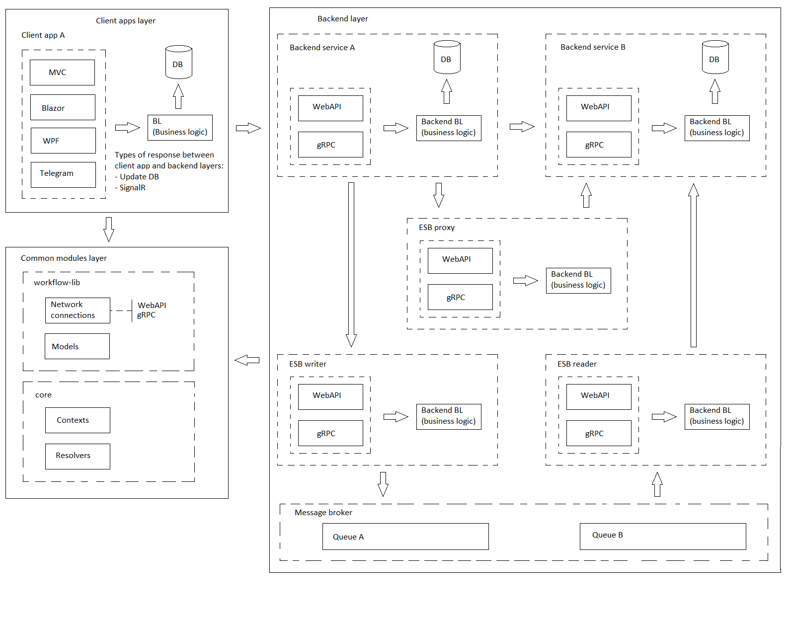

# gettingstarted

[English](gettingstarted.md) | [Русский](gettingstarted.ru.md)

## Правила именования

### API-методы

Для API-методов, которые обеспечивают выполнение задач, связанных с бизнес-процессами, нужно выделить отдельный контроллер, который может называться, например, `BusinessController`.

Многие процессы на данной платформе имеют событийно-ориентированный способ коммуникации между микросервисами. 
Соответственно, клиентское приложение обычно имеет следующие API-методы:
- Получение/регистрация задачи для пользователя, т.е. сохраняет её в БД;
- Отображение задачи на пользовательском интерфейсе;
- Отправка задачи на бэкэнд-сервис как выполненную.

Для именования API-методов используется имя бизнес-процесса и определённый постфикс, т.е. `ProcessPostfix` (например, `Wh2KitchenSave`, `Wh2KitchenRespond`, `MakeOrderRequest`).

Можно выделить следующие постфиксы для методов, ориентированных на бизнес-процессы:
- `Start`: действия, которые направлены на **запуск** процесса;
- `Request`: действия пользователя, которые направлены на **запуск** или **запрос** процесса;
- `Respond`: действия пользователя, которые направлены на **ответ** или **выполнение** некоторого действия в рамках процесса;
- `Execute`: действия пользователя, которые направлены на **выполнение** некоторого действия в рамках процесса;
- `Accept`: действия пользователя, которые направлены на **подтверждение** некоторого действия/события в рамках процесса;
- `Decline`: действия пользователя, которые направлены на **отклонение** некоторого действия/события в рамках процесса;
- `Get`: запросы, направленные на **получение данных** из БД, в контексте некоторого процесса;
- `Save`: запросы, направленные на **сохранение данных** в БД и последующий редирект на другой сервис/контроллер;
- `Redirect`: то же самое, что `Save`.

Теоретически можно столкнуться с потенциальной ситуацией, когда нужно произвести дифференциацию (разделение) двух или трёх задач, предназначенных для одного и того же пользователя или инстанса приложения, в рамках одного процесса. 
Скорее всего, рекомендуется просто переносить функционал второстепенной задачи в отдельный бизнес-процесс, чтобы избежать путаницы в наименовании методов. 

## Выполнение миграций для базы данных 

Ниже представлена диаграмма взаимодействия между слоями приложения:

Для корректной работы с миграциями для базы данных предлагается следующее решение:
- Создать скрипт (или приложение для запуска скриптов), что позволило бы выполнять миграции сразу для всех сервисов.
- При разработке в случае изменения моделей или DbContext выполнить скрипт для миграций.
