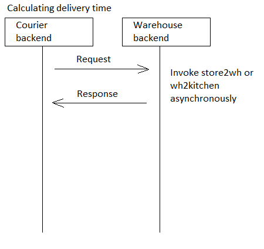

# preprocessorder

[English](preprocessorder.md) | [Русский](preprocessorder.ru.md)

Name: **Preprocess order**.

The preprocessing order scenario in the delivery service app involves retrieving recipes from the database, calculating the required and actual amount of ingredients, and asynchronously invoking processes for delivering ingredients to the kitchen or products from the store into the warehouse. 
Based on these calculations, the app determines the estimated delivery time for the order.

Process pattern: [delivering](../../processpatterns/delivering.md)

Responsible modules: [backend service](../../backend/customerbackend.md)

Platform version: v0.1

## Dependencies

### Depends on

| Backend service | Process |
| --- | ---- |
| [customerbackend](../../backend/customerbackend.md) | [makeorder](../customer/makeorder.md) |

### Influences on

| Backend service | Process |
| --- | ---- |
| [warehousebackend](../../backend/warehousebackend.md) | [wh2kitchen](../warehouse/wh2kitchen.md) |
| [warehousebackend](../../backend/warehousebackend.md) | [kitchen2wh](../warehouse/kitchen2wh.md) |
| [kitchenbackend](../../backend/kitchenbackend.md) | [preparemeal](../kitchen/preparemeal.md) |
| [courierbackend](../../backend/courierbackend.md) | [store2wh](../courier/store2wh.md) |
| [courierbackend](../../backend/courierbackend.md) | [deliverorder](../courier/deliverorder.md) |

## Process description

- The [Delivery Service Application](../../../README.ru.md) includes a script that pre-processes the order before sending it to the kitchen for preparation.
- Executed automatically as part of the [makeorder](../customer/makeorder.ru.md) process.
- Backend services involved: [customerbackend](../../backend/customerbackend.md), [warehousebackend](../../backend/warehousebackend.md), [kitchenbackend](../../backend/kitchenbackend.md), [courierbackend](../../backend/courierbackend.ru.md).
- The database has tables [delivery_recipe_cb](../../dbtables/customer/delivery_recipe_cb.md), [delivery_ingredient_cb](../../dbtables/customer/delivery_ingredient_cb.md) and [delivery_menuitem_cb](../../dbtables/customer/delivery_menuitem_cb.md), which contains recipes for each product indicating the required starting products and their quantity/weight/volume. Recipes are necessary so that on their basis it is possible to obtain the quantity of initial products required to complete the order.
     - Data from these tables comes from the database related to the [managerbackend](../../backend/managerbackend.ru.md) service using the replication mechanism.
- The database has a table [delivery_whproduct_whb](../../dbtables/warehouse/customer/delivery_whproduct_whb.md), which stores data on products in the warehouse at the current time.

### Step-by-step execution

- The service receives a request including order parameters that were specified by the client (the order is represented as an object [DeliveryOrder](https://github.com/alexeysp11/workflow-lib/blob/main/src/Models/Business/BusinessDocuments/DeliveryOrder.cs)).
- If the **quantity** in the warehouse is **not enough**, then the process [Deliver from store to warehouse](../courier/store2wh.md) is started asynchronously, and a response is sent to the service that called this process.
- If there is **enough quantity** in the warehouse, then the [Deliver from warehouse to kitchen](../warehouse/wh2kitchen.md) process is started asynchronously, and a response is sent to the service that called this process.

### Sequence diagrams

In fact, the execution of this process in terms of HTTP requests is limited to obtaining data on the estimated delivery time of the order.

According to the step-by-step execution, this request must store information about the sequence of called processes (this is done for ease of design and understanding of the system).
However, this process actually updates within HTTP requests executed within child processes.

For example, after preparing an order and sending it to the warehouse, according to the step-by-step execution diagram, the [sendnotifications](../notificationsbackend/sendnotifications.md) process is called (see also the [getnotified](../notificationsbackend/getnotified.md) process sequence diagram).

## Data structures

| Object | DTO | Database table |
| --- | ---- | --- |
| [Employee](https://github.com/alexeysp11/workflow-lib/blob/main/src/Models/Business/InformationSystem/Employee.cs) | EmployeeDTO | [delivery_employee_whb](../../dbtables/warehouse/delivery_employee_whb.md) |
| [UserAccount](https://github.com/alexeysp11/workflow-lib/blob/main/src/Models/Business/InformationSystem/UserAccount.cs) | UserAccountDTO | [delivery_useraccount_whb](../../dbtables/warehouse/delivery_useraccount_whb.md) |
| [Ingredient](https://github.com/alexeysp11/workflow-lib/blob/main/src/Models/Business/Products/Ingredient.cs) | IngredientDTO | [delivery_ingredient_cb](../../dbtables/customer/delivery_ingredient_cb.md) |
| [Product](https://github.com/alexeysp11/workflow-lib/blob/main/src/Models/Business/Products/Product.cs) | ProductDTO | [delivery_menuitem_cb](../../dbtables/customer/delivery_menuitem_cb.md) |
| [Recipe](https://github.com/alexeysp11/workflow-lib/blob/main/src/Models/Business/Products/Recipe.cs) | RecipeDTO | [delivery_recipe_cb](../../dbtables/customer/delivery_recipe_cb.md) |
| [WHProduct](https://github.com/alexeysp11/workflow-lib/blob/main/src/Models/Business/Products/WHProduct.cs) | WHProductDTO | [delivery_whproduct_whb](../../dbtables/warehouse/delivery_whproduct_whb.md) |
