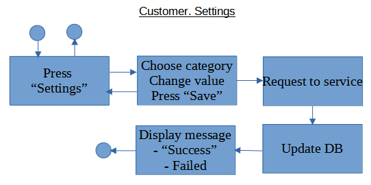

# customer.settings 

Read this in other languages: [English](customer.settings.md), [Russian/Русский](customer.settings.ru.md). 

Customer client application: settings.

The description of the **client application** is presented at [this link](../../frontend/customerclient.md).

## Process description

- Settings and personal data page:
    - Personal information:
        - login,
    - Communication:
        - email,
        - telephone,
        - connected messengers: WhatsApp, Viber, Telegram,
        - nickname in Telegram,
        - preferred method of communication: e-mail, phone, one of the messengers,
    - Payment:
        - preferred payment method,
        - linked cards.
    - Usability:
        - default delivery location,
        - file extension for loading by default (*maybe this parameter is not needed*).
    - Safety:
        - password.

## Sequence of user actions

- The user opens "Settings".
- The user scrolls through the list of settings, selects a category and a specific parameter.
- At the bottom of the page there is a button "Save changes".
    - Changes get to the services, after the response from the service - to the database.
    - After that, the user is shown on the interface: "Successful" or "An error occurred".
