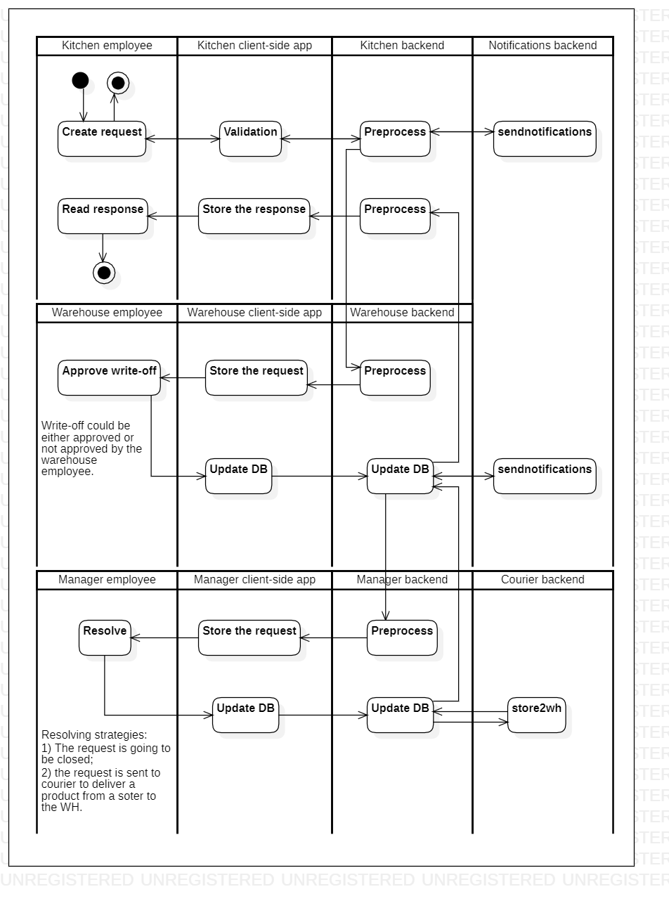

# requestingedients

[English](requestingedients.md) | [Русский](requestingedients.ru.md)

Name: **Request ingredients**.

An ingredient request scenario in a delivery service application allows kitchen staff to request additional or missing ingredients as needed to fill incoming orders.
The application sends these requests to the warehouse or other relevant departments for fulfillment.

Process pattern: [requesting](../../processpatterns/requesting.md)

Responsible modules: [client application](../../frontend/kitchenclient.md), [backend service](../../backend/kitchenbackend.md)

Platform version: v0.1

## Dependencies

### Influences on

| Backend service | Process |
| --- | ---- |
| [notificationsbackend](../../backend/notificationsbackend.md) | [sendnotifications](../notificationsbackend/sendnotifications.md) |
| [courierbackend](../../backend/courierbackend.md) | [store2wh](../courier/store2wh.md) |

## Process description

### Step-by-step execution

- Kitchen employee logs into the app and navigates to the "Ingredient Request" section
- Employee selects the required ingredients from a pre-defined list or enters custom requests
- App generates a request form with the selected ingredients and quantities
- Employee submits the request form
- App sends the request to the inventory controller to approve the write-off
- Manager reviews and approves the request
- Approved request triggers an automatic update of inventory levels and notifies the employee

## Data structures

- IngredientRequest: properties could include ingredientID, ingredientName, quantityRequested, and kitchenID.
- Ingredient: properties could include ingredientID, ingredientName, quantityAvailable, and supplierInfo.
- Order: properties could include orderID, customerName, itemsOrdered, and orderStatus.
