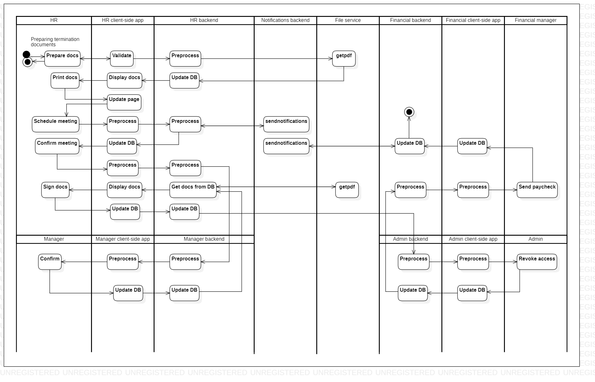

# terminationofemployment

[English](terminationofemployment.md) | [Русский](terminationofemployment.ru.md)

Name: **Termination of employment**.

The scenario responsible for termination of employment by manager in the delivery service company involves using the management app to initiate the termination process for an employee, including documenting the reason for termination and ensuring that all necessary paperwork and processes are completed.

Process pattern: [organizational](../../processpatterns/organizational.md)

Responsible modules: [client application](../../frontend/managerclient.md), [backend service](../../backend/managerbackend.md).

## Process description

### Step-by-step execution

- The manager opens the app on their device.
- The manager selects the "Terminate Employment" option.
- The system displays a list of employees and their current employment status.
- The manager selects an employee and provides a reason for termination.
- The system updates the employee's status in the database and notifies HR to proceed with the termination process.

## Data structures

### Objects

- TerminationRequest
    - TerminationRequest object could have properties like employeeName, employeeID, terminationReason, terminationDate, etc. 
- [Employee](https://github.com/alexeysp11/workflow-lib/blob/main/src/Models/Business/InformationSystem/Employee.cs)
- [EmploymentContract](https://github.com/alexeysp11/workflow-lib/blob/main/src/Models/Business/BusinessDocuments/EmploymentContract.cs)

### DTOs

- TerminationRequestDTO
    - TerminationRequestDTO could have properties like employeeName, employeeID, terminationReason, terminationDate, managerName, managerID, etc.
